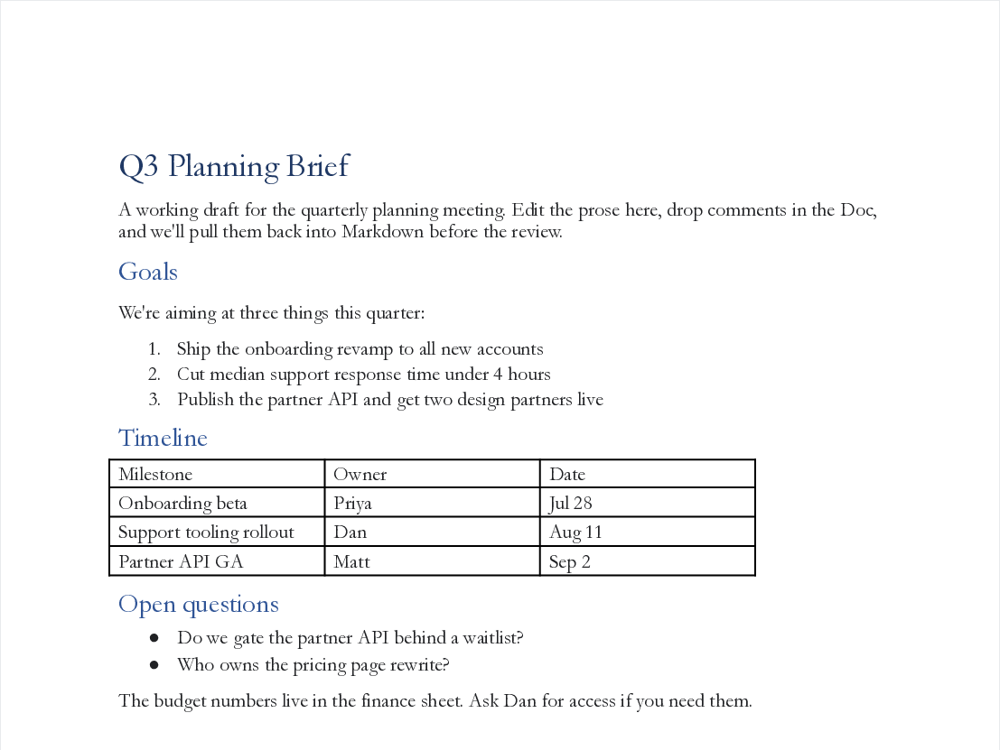

# gdoc-sync

Sync Markdown files with Google Docs from the command line.

You write in Markdown. Your reviewers live in Google Docs. gdoc-sync moves the
document both ways, including the comments, so nobody has to switch tools.


```bash
gdoc-sync create draft.md   # new Google Doc: styled, shared, URL on your clipboard
gdoc-sync push  draft.md    # local edits go to the same doc (URL and sharing survive)
gdoc-sync pull  draft.md    # doc edits and reviewer comments come back into your Markdown
```

Here's what a pushed doc looks like (the default `professional` theme):



## Why

Existing tools convert one way, or sync content and drop the conversation.
gdoc-sync round-trips **comments**: they land in your Markdown as
[CriticMarkup](https://github.com/CriticMarkup/CriticMarkup-toolkit)
annotations anchored to the quoted text, and you can reply to or resolve them
from your editor. It also applies real styling (font and a color theme) on
every push, so the doc you share doesn't look like a raw import.

Editing in Neovim? [gdoc-sync.nvim](https://github.com/MattHandzel/gdoc-sync.nvim)
puts all of this behind `:Gdoc` in the buffer you're writing.

## Install

Linux and macOS are both supported (CI runs both).

```bash
# pipx or uv, any platform
pipx install git+https://github.com/MattHandzel/gdoc-sync
# or
uvx --from git+https://github.com/MattHandzel/gdoc-sync gdoc-sync --help

# Nix
nix run github:MattHandzel/gdoc-sync -- --help
```

You also need [pandoc](https://pandoc.org/installing.html) on your PATH (the
Nix package bundles it):

```bash
brew install pandoc        # macOS
sudo apt install pandoc    # Debian/Ubuntu
```

Then do the one-time OAuth setup (~5 minutes, Google makes everyone bring
their own client): **[docs/oauth-setup.md](docs/oauth-setup.md)**, then

```bash
gdoc-sync auth --client ~/Downloads/client_secret_*.json
gdoc-sync doctor           # confirms everything is wired up
```

## Commands

- **create** turns Markdown into a new Google Doc via pandoc, so headings,
  lists, tables, images, code blocks, and links survive. The title comes from
  your first `# H1`, YAML `title:`, or the filename. The URL is printed and
  copied to your clipboard, and the doc is shared anyone-with-link-can-comment
  by default (`--edit`, `--view`, `--private`, `--share-with alice@x.com:edit`
  to change it).
- **push** replaces the linked doc's content in place. The doc id, URL, and
  sharing are untouched. If someone edited the doc since your last pull, you
  get warned before overwriting (`--yes` for scripts). Reply, resolve, and
  comment markers in the file are applied to the doc's comment threads (see
  below).
- **pull** brings the doc back as clean Markdown, including multi-tab
  documents, with every unresolved comment embedded as `{>>Author: text<<}`
  right after the text it anchors to. Images download to `<name>-assets/`.
  Your local YAML frontmatter is preserved. `--json` for scripts.
- **watch** is live sync: remote edits pull automatically, local saves push
  automatically, and if both sides changed in the same tick the remote version
  is written to `<name>.conflict.md` so nothing gets clobbered.
- **status** and **diff** tell you what's linked and what drifted before you
  overwrite either side.
- **share** and **export** change sharing on an existing doc and export it as
  pdf, docx, odt, txt, html, or epub.
- **doctor** checks pandoc, config, the OAuth client, the token, and the API,
  and tells a new user exactly what's missing.
- **link / unlink / open / auth / config** do what they say.
- **rainbow** makes the first paragraph of any doc rainbow-colored. No further
  justification will be offered.

## Comments

Pulled comments arrive anchored in your prose:

```markdown
The proposal hinges on the Q3 numbers{>>Maya Chen: source for these?<<}.
```

Answer them without leaving your editor. Put a marker right after the pulled
comment and push:

```markdown
...the Q3 numbers{>>Maya Chen: source for these?<<}{>>reply: added in the appendix<<}.
...the intro paragraph{>>Sam: too long<<}{>>resolve: trimmed<<}.
A brand-new note for the doc:{>>comment: should we cite the 2025 survey?<<}
```

On push, the reply lands on Maya's thread, Sam's thread gets resolved, and the
new comment appears on the doc quoting your line. All `{>>...<<}` markers are
stripped from the pushed content itself.

## Configuration

Settings live at `~/.config/gdoc-sync/config.yaml` (override with `--config`
or `$GDOC_SYNC_CONFIG`). Everything has a default, so the file is optional.

```yaml
defaults:
  font: Garamond            # any font name from the Google Docs font picker
  theme: professional       # see the theme list below, or "none"
  share: comment            # private | view | comment | edit
  clipboard: true

# Your own themes. heading_color takes one color for every heading level;
# use headings: for a per-level list or map instead.
themes:
  acme:
    background: "#ffffff"
    text: "#1f2933"
    link: "#0b57d0"
    pageless: false
    heading_color: "#7c2d12"

# Optional: keep sync state (the file-to-doc mappings) somewhere synced or
# versioned. Default: ~/.local/state/gdoc-sync/state.yaml
# state_file: ~/notes/.gdoc-sync-state.yaml
```

Built-in themes:

| Theme | Look |
|---|---|
| `professional` (default) | Paginated, near-black text, navy heading ramp. Reads like a normal work doc. |
| `minimal` | Black on white, no accent colors, pageless. |
| `catppuccin-latte` | Light [Catppuccin](https://catppuccin.com), rainbow headings by level. |
| `catppuccin-frappe` / `catppuccin-macchiato` / `catppuccin-mocha` | The dark Catppuccin flavors. |

`gdoc-sync config` prints your effective settings and every available theme,
including your custom ones. Per-invocation overrides: `--font` and `--theme`
on create and push.

## macOS notes

Everything works the same on macOS: the clipboard uses `pbcopy`, watch-mode
notifications use `osascript`, and config lives at `~/.config/gdoc-sync/`.
Install pandoc with `brew install pandoc`. CI runs the test suite on macOS on
every commit.

## Limitations (honest ones)

- **New anchored comments can't be created through the API.** Google's Drive
  API saves but ignores comment anchors on Google Docs
  ([issue 292610078](https://issuetracker.google.com/issues/292610078)), so no
  third-party tool can highlight-comment a text range. That's why
  `{>>comment: ...<<}` becomes a doc-level comment quoting your text, while
  replies and resolves (which the API supports) attach to the real thread.
- Push replaces the whole doc body. Comments survive it; suggested-edit
  history doesn't.
- Pull produces straightforward Markdown. Footnotes and deeply nested
  formatting aren't round-trip-faithful yet, and `diff` compares that lossy
  representation.
- `watch` polls (default every 30s). Google's real push notifications need a
  public webhook, which a CLI doesn't have.

## Roadmap

- Publish to PyPI
- Service-account auth for CI, plus a GitHub Action recipe
- Folder/batch sync with `.gdocsyncignore`
- Library API (`import gdoc_sync`)

## Development

```bash
nix develop        # or: pip install -e ".[dev]"
pytest -q
ruff check src tests
```

The demo GIF is rendered with [vhs](https://github.com/charmbracelet/vhs)
against the real API: `demo/render.sh`.

MIT © Matthew Handzel
