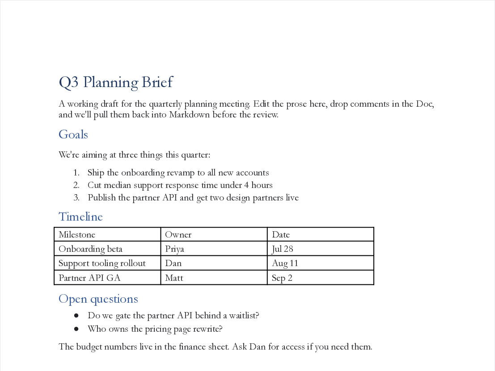

# gdoc-sync

Sync Markdown files with Google Docs from the command line.

You write in Markdown. Your reviewers live in Google Docs. gdoc-sync moves the
document both ways, including the comments, so nobody has to switch tools.


```bash
gdoc-sync create draft.md   # new Google Doc: styled, shared, URL on your clipboard
gdoc-sync push  draft.md    # local edits go to the same doc (URL and sharing survive)
gdoc-sync pull  draft.md    # doc edits and reviewer comments come back into your Markdown
```

Here's what a pushed doc looks like (the default `professional` theme):



## Why

Existing tools convert one way, or sync content and drop the conversation.
gdoc-sync round-trips **comments**: they land in your Markdown as
[CriticMarkup](https://github.com/CriticMarkup/CriticMarkup-toolkit)
annotations anchored to the quoted text, and you can reply to or resolve them
from your editor. It also applies real styling (font and a color theme) on
every push, so the doc you share doesn't look like a raw import.

Editing in Neovim? [gdoc-sync.nvim](https://github.com/MattHandzel/gdoc-sync.nvim)
puts all of this behind `:Gdoc` in the buffer you're writing.

## Install

Linux and macOS are both supported (CI runs both).

```bash
# pipx or uv, any platform
pipx install git+https://github.com/MattHandzel/gdoc-sync
# or
uvx --from git+https://github.com/MattHandzel/gdoc-sync gdoc-sync --help

# Nix
nix run github:MattHandzel/gdoc-sync -- --help
```

You also need [pandoc](https://pandoc.org/installing.html) on your PATH (the
Nix package bundles it):

```bash
brew install pandoc        # macOS
sudo apt install pandoc    # Debian/Ubuntu
```

Then do the one-time OAuth setup (~5 minutes, Google makes everyone bring
their own client): **[docs/oauth-setup.md](docs/oauth-setup.md)**, then

```bash
gdoc-sync auth --client ~/Downloads/client_secret_*.json
gdoc-sync doctor           # confirms everything is wired up
```

## Commands

- **create** turns Markdown into a new Google Doc via pandoc, so headings,
  lists, tables, images, code blocks, and links survive. The title comes from
  your first `# H1`, YAML `title:`, or the filename. The URL is printed and
  copied to your clipboard, and the doc is shared anyone-with-link-can-comment
  by default (`--edit`, `--view`, `--private`, `--share-with alice@x.com:edit`
  to change it).
- **push** replaces the linked doc's content in place. The doc id, URL, and
  sharing are untouched. If someone edited the doc since your last pull, you
  get warned before overwriting (`--yes` for scripts). Reply, resolve, and
  comment markers in the file are applied to the doc's comment threads (see
  below).
- **pull** brings the doc back as clean Markdown, including multi-tab
  documents, with every unresolved comment embedded as `{>>Author: text<<}`
  right after the text it anchors to. Images download to `<name>-assets/`.
  Your local YAML frontmatter is preserved. `--json` for scripts.
- **sync** reconciles a file with its doc once: a real three-way merge, so
  edits made on both sides both survive (see [Two-way sync](#two-way-sync)).
- **watch** is that same reconcile on a timer — live two-way sync. `--json`
  emits one event per line for editor integrations.
- **resolve** clears a conflict once you have sorted the file out; **restore**
  brings back any of the automatic backups.
- **status** and **diff** tell you what's linked and what drifted before you
  overwrite either side.
- **share** and **export** change sharing on an existing doc and export it as
  pdf, docx, odt, txt, html, or epub.
- **doctor** checks pandoc, config, the OAuth client, the token, and the API,
  and tells a new user exactly what's missing.
- **link / unlink / open / auth / config** do what they say.
- **rainbow** makes the first paragraph of any doc rainbow-colored. No further
  justification will be offered.

## Comments

Pulled comments arrive anchored in your prose:

```markdown
The proposal hinges on the Q3 numbers{>>Maya Chen: source for these?<<}.
```

Answer them without leaving your editor. Put a marker right after the pulled
comment and push:

```markdown
...the Q3 numbers{>>Maya Chen: source for these?<<}{>>reply: added in the appendix<<}.
...the intro paragraph{>>Sam: too long<<}{>>resolve: trimmed<<}.
A brand-new note for the doc:{>>comment: should we cite the 2025 survey?<<}
```

On push, the reply lands on Maya's thread, Sam's thread gets resolved, and the
new comment appears on the doc quoting your line. All `{>>...<<}` markers are
stripped from the pushed content itself.

## Two-way sync

`gdoc-sync sync` (once) and `gdoc-sync watch` (on a timer) reconcile a file and
its doc without either side winning by default.

**Why it needs a memory.** `md → pandoc → docx → Google Doc → md` is not the
identity function: the markdown that comes back out of a doc is never
byte-identical to what went in. So "the file differs from the doc" tells you
nothing about whether anyone edited anything. Instead, each successful sync
stores two snapshots — the local file's bytes, and what the doc rendered to at
that moment — and each side is compared against **its own** snapshot. Round-trip
noise can't masquerade as an edit, and a doc sitting open in a browser tab
(which rewrites its `revisionId` constantly) doesn't look like a stream of
remote changes.

**What happens when both sides moved.** The doc's changes are replayed onto
your file with a three-way merge, exactly as git would:

```
$ gdoc-sync sync notes.md
notes.md: merged remote and local changes, pushed
  backup: ~/.local/state/gdoc-sync/backups/notes-3f2a….20260726-141230.pre-merge.md
```

Edits in different parts of the document all survive. Only genuinely
overlapping edits conflict, and a conflict:

- writes git-style markers into the file (or, with `conflict_style: sidecar`,
  leaves your file alone and drops the doc's version in `<name>.remote.md`);
- is **sticky** — recorded in the state file, surviving restarts, and
  suspending automatic sync for that file so nothing overwrites the
  un-merged side while you think;
- clears itself when you remove the markers, or on `gdoc-sync resolve <file>`.

**Nothing is written without a way back.** Every write to a tracked file is
preceded by a timestamped backup and performed atomically:

```
gdoc-sync restore notes.md              # list the backups
gdoc-sync restore notes.md --index 0    # bring the newest one back
```

**When it refuses to act.** With no stored snapshot and two sides that already
differ, there is no safe merge base and the engine will not guess — run
`gdoc-sync diff`, then `sync --adopt-local` (push yours) or `--adopt-remote`
(take the doc's). It also refuses to push an emptied file over a doc that has
content (`--force` overrides), and abandons a merge if the file changes
underneath it mid-sync.

## Configuration

Settings live at `~/.config/gdoc-sync/config.yaml` (override with `--config`
or `$GDOC_SYNC_CONFIG`). Everything has a default, so the file is optional.

```yaml
defaults:
  font: Garamond            # any font name from the Google Docs font picker
  theme: professional       # see the theme list below, or "none"
  share: comment            # private | view | comment | edit
  clipboard: true
  conflict_style: markers   # markers (git-style, in the file) | sidecar
  watch_interval: 15        # seconds between polls for `watch`

# Only needed if the auto-detected clipboard tool is wrong for your setup.
# gdoc-sync already picks wl-copy / xclip / xsel / pbcopy / clip.exe (WSL) /
# termux-clipboard-set by platform, and falls back to an OSC 52 escape so a
# copy still reaches you over plain SSH.
# clipboard_command: "xsel --clipboard --input"

# Your own themes. heading_color takes one color for every heading level;
# use headings: for a per-level list or map instead.
themes:
  acme:
    background: "#ffffff"
    text: "#1f2933"
    link: "#0b57d0"
    pageless: false
    heading_color: "#7c2d12"

# Optional: keep sync state (the file-to-doc mappings) somewhere synced or
# versioned. Default: ~/.local/state/gdoc-sync/state.yaml
# state_file: ~/notes/.gdoc-sync-state.yaml
```

Built-in themes:

| Theme | Look |
|---|---|
| `professional` (default) | Paginated, near-black text, navy heading ramp. Reads like a normal work doc. |
| `minimal` | Black on white, no accent colors, pageless. |
| `catppuccin-latte` | Light [Catppuccin](https://catppuccin.com), rainbow headings by level. |
| `catppuccin-frappe` / `catppuccin-macchiato` / `catppuccin-mocha` | The dark Catppuccin flavors. |

`gdoc-sync config` prints your effective settings and every available theme,
including your custom ones. Per-invocation overrides: `--font` and `--theme`
on create and push.

## macOS notes

Everything works the same on macOS: the clipboard uses `pbcopy`, watch-mode
notifications use `osascript`, and config lives at `~/.config/gdoc-sync/`.
Install pandoc with `brew install pandoc`. CI runs the test suite on macOS on
every commit.

## Math (LaTeX)

`$x$` and `$$...$$` become **native Google Docs equations** — real equations a
reviewer can click into and edit, not pictures of formulas. Nothing to enable:

```markdown
$$Y_{\text{eff}} = \frac{I}{T}, \qquad Y_{\text{tot}} = Y_{\text{eff}} \cdot \frac{B}{c}$$

$I$ — count of insights in a period; $T$ — tokens consumed, in millions.
```

Dollar signs in prose stay prose: `it costs $5 and $10` is not math, following
pandoc's rule that a delimiter is never preceded or followed by a space. `\$`
escapes explicitly, and math inside `` `code` `` or a fenced block is left
alone.

Pulling is the hard direction, because the Docs API returns every equation as
an empty object — no LaTeX, no MathML, no text at all:

```json
{"startIndex": 12, "endIndex": 53, "equation": {}}
```

The source therefore cannot be read back out of the doc; it is restored from
your local file, the only copy that still has it. What follows from that:

- A round trip is **lossless** so long as the equations themselves were not
  edited in Google Docs — including when reviewers rewrite the prose around
  them, move paragraphs, or comment throughout.
- An equation **edited in Google Docs cannot be detected**. There is nothing in
  the API response to compare against, so your local LaTeX wins.
- An equation **added in Google Docs** has no local counterpart and arrives as
  a visible `` `[equation]` `` marker, with a warning saying how many. Nothing
  is ever dropped silently, and only the paragraph that actually changed is
  affected — not the rest of the file.
- LaTeX pandoc cannot parse (`$m^$`) is reported when you push, and appears in
  the doc as literal text instead of a formula.

## Callouts

`> [!NOTE]` blocks — GitHub calls them alerts, Obsidian calls them callouts —
become **coloured, titled panels** in the doc: a tinted background, an accent
rule down the left edge, and an icon beside the title. The look `obsidian.nvim`
gives you, in a document you can share with someone who has never heard of
Obsidian.

```markdown
> [!WARNING] Do not deploy on a Friday
> Anything can go in here — paragraphs, lists, code, math.
>
> - and it stays inside the panel
> - where it belongs
```

Every type either tool defines is understood, with all of Obsidian's aliases:

| Renders as | Write any of |
| --- | --- |
| ℹ️ Note | `note`, `info` |
| 📋 Abstract | `abstract`, `summary`, `tldr` |
| ☑️ Todo | `todo` |
| 💡 Tip | `tip`, `hint` |
| ❗ Important | `important` |
| ✅ Success | `success`, `check`, `done` |
| ❓ Question | `question`, `help`, `faq` |
| ⚠️ Warning | `warning`, `attention` |
| 🛑 Caution | `caution` |
| ❌ Failure | `failure`, `fail`, `missing` |
| ⛔ Danger | `danger`, `error` |
| 🐛 Bug | `bug` |
| 🧪 Example | `example` |
| 💬 Quote | `quote`, `cite` |

Details worth knowing:

- **Colours follow your theme.** They are derived from the page rather than
  tabulated, so a dark theme — or one of your own from `themes:` — gets
  callouts that belong to it, with the accent lifted enough to stay readable.
- **Custom titles round trip.** `> [!TIP] Try this first` keeps its title in
  both directions.
- **Your spelling is preserved.** `[!INFO]` and `[!NOTE]` render identically,
  and a fold marker (`[!NOTE]-`) means nothing in a Google Doc — so both are
  restored from your local file rather than rewritten on every pull.
- Where GitHub and Obsidian disagree — Obsidian treats `important` as a synonym
  of `tip`, and `caution` of `warning` — GitHub wins and all five stay distinct.
- An unrecognised type (`> [!SOMETHINGELSE]`) stays an ordinary blockquote, and
  a callout inside a code fence stays code.

Under the hood each callout becomes a one-row, one-column table, because that
is the only structure the Docs API can give an exact *extent* to. Blockquote
paragraphs arrive indented — but a list inside one arrives with a bullet's own
indents instead, so anything deciding "where does this callout end?" from
indentation stops at the first bullet.

## Limitations (honest ones)

- **New anchored comments can't be created through the API.** Google's Drive
  API saves but ignores comment anchors on Google Docs
  ([issue 292610078](https://issuetracker.google.com/issues/292610078)), so no
  third-party tool can highlight-comment a text range. That's why
  `{>>comment: ...<<}` becomes a doc-level comment quoting your text, while
  replies and resolves (which the API supports) attach to the real thread.
- Push replaces the whole doc body. Comments survive it; suggested-edit
  history doesn't.
- **A plain `>` blockquote comes back as an ordinary indented paragraph.**
  Google Docs has no blockquote of its own — pandoc expresses one as indent —
  so a pull cannot tell it apart from text somebody indented by hand. Callouts
  are unaffected, being tables, and the content is never lost; only the `>`
  is.
- Pull produces straightforward Markdown. Deeply nested formatting isn't
  round-trip-faithful yet, and `diff` compares that lossy representation. The
  sync engine is built around this fact rather than pretending otherwise — see
  [Two-way sync](#two-way-sync) — so lossiness costs you fidelity, not content.
- `watch` polls (default every 15s). Google's real push notifications need a
  public webhook, which a CLI doesn't have. Edits made in Google Docs therefore
  take up to one interval to arrive.
- A merge is line-based, like git's. Two people rewriting the *same paragraph*
  in different ways is a conflict you resolve by hand, not something the tool
  can settle for you.

## Roadmap

- Publish to PyPI
- Service-account auth for CI, plus a GitHub Action recipe
- Folder/batch sync with `.gdocsyncignore`
- Library API (`import gdoc_sync`)

## Development

```bash
nix develop        # or: pip install -e ".[dev]"
pytest -q
ruff check src tests
```

The offline suite covers the sync engine's full decision table against fakes —
including the three-way merge through both `git merge-file` and the pure-Python
fallback. Two-way sync also has a real-API end-to-end test, because the failure
mode it guards against only appears against the genuine round trip and Google's
`revisionId` churn:

```bash
python3 tests/e2e/two_way_sync.py
```

It uses an isolated config/state pair (your real mappings are untouched),
creates one private doc, edits it from both sides, checks that both edits
survive, exercises the conflict path, and trashes the doc on the way out.

The demo GIF is rendered with [vhs](https://github.com/charmbracelet/vhs)
against the real API: `demo/render.sh`.

MIT © Matthew Handzel
